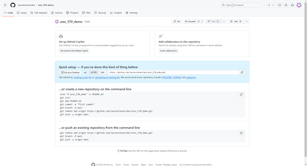

## README

Repository for AREC 570 GitHub Version Control Demo.

### Before You Start

1. Make sure you have Git installed on your computer.

 

2. Set up an account on GitHub.

 

### Part One: Setting up your project for version control

1. Create a local project directory on your computer, for example: `C:/Users/lachenar/OneDrive - Colostate/Documents/GitProjectsWithR/arec_570_demo`

2. Initialize Git in RStudio

- Open RStudio

- Create a new project as a subdirectory of the directory above

- Go to Tools > Version Control > Git and initialize a Git repository (Select "Yes"). Restart RStudio if prompted.

 

3. Stage and commit the files under the Git tab. 

### Part Two: Connecting your project to GitHub

1. Sign into your GitHub account.

2. Create a new repository, for example `arec_570_demo`

 

3. Select the copy icon under “…or push an existing repository from the command line” 

 

4. Navigate to the Terminal Windo in RStudio. Paste the command line code.

 

5. Go back to Chrome (or whichever browser you’re using) and refresh your browser

 

### Part Three: Create a README.md file

1. In RStudio, and select File > New File > Markdown File

 

2. Save it as README.md.

3. Stage it, select Commit, add a Commit message, and select Commit again.

 

4. “Push” the file up to GitHub. 

 

5. Go to your GitHub repo and refresh the page to confirm that it was uploaded.

### Best practices

1. Use pull requests if collaborating with others.

- When collaborating with others, always create a pull request to propose changes. This allows team members to review, discuss, and approve changes before merging them into the main branch. This process helps maintain code quality and prevent conflicts.

2. Commit frequently with descriptive messages.

- Make small, frequent commits with clear, descriptive messages about the changes you’ve made. This practice makes it easier to track changes, troubleshoot issues, and understand the project's history.

### Helpful terminal commands

- Clear Workspace: Open RStudio, and in the Terminal window, type the following to ensure your working directory is clean:  **`git stash`**

- Pull Latest Changes: Still in the Terminal, pull the latest changes from the repository to make sure you're working with the most current version:  **`git pull origin main`**

- Commit and Push Changes: Add all changes to Git, commit them with a descriptive message about the updates, and push them to GitHub:
  - **`git add –A`** 
  - **`git commit -m "Describe your updates here"`**
  - **`git push -u origin main`**
